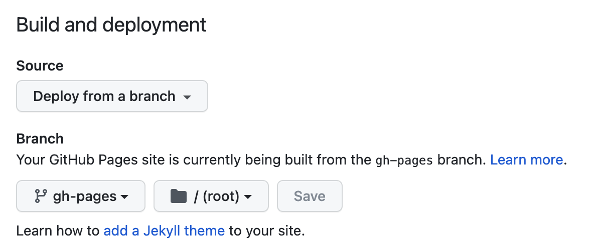

# Docusaurus website

This website is built using [Docusaurus 2](https://docusaurus.io/), a modern static website generator. See it live at https://agarthetiger.github.io/docusaurus

### Installation

```
$ npm install
```

### Local Development

```
$ npm run serve
```

This command starts a local development server and opens up a browser window. Most changes are reflected live without having to restart the server.

Note that the search plugin being used, https://github.com/praveenn77/docusaurus-lunr-search , requires a production 'build' to generate the index. See build below.

Commit straight to `main`, there is no need on a personal website to use any branching other than using `gh-pages` to serve the static website.

### Build

```
$ npm build
```

This command generates static content into the `build` directory and can be served using any static contents hosting service.

### Deployment

While it is possible to deploy this to the gh-pages branch from local, best not to. GitHub Actions is configured to build and deploy from the main branch.

### Configuration


